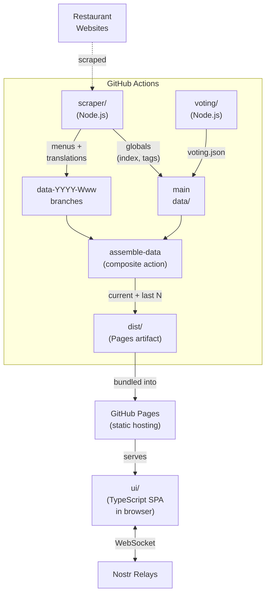
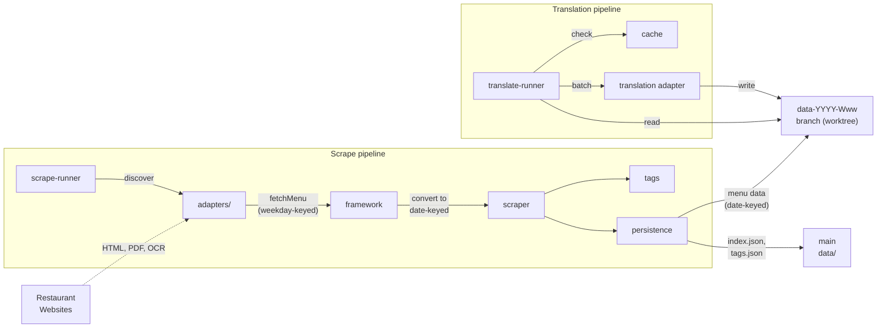
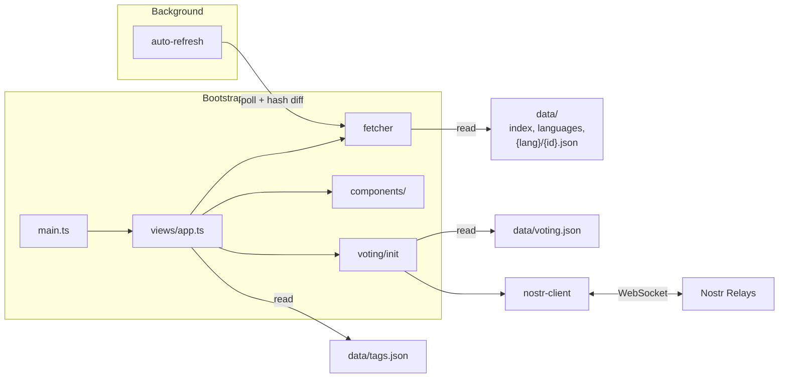

# Peckish

**Discover lunch menus. Vote with your team. Decide where to eat.**

Peckish aggregates daily lunch menus from a wide range of restaurants near Austria Campus in Vienna and lets you vote on where to eat using decentralized [Nostr](https://nostr.com/) protocol, no accounts, no signups, no servers.

Most restaurants in the area only publish their menus in German. For colleagues who don't speak German well, that turns lunch into a guessing or lookup game. Peckish scrapes these menus, translates them automatically, and lets everyone read the menu and vote on where to go in a language they understand.

> **Try it out for yourself: https://djaffry.github.io/mahlzeit-test/**

## Features

### Menu Aggregation & Scraping

A pluggable adapter pipeline scrapes lunch menus daily across a range of cuisines - local Viennese classics, Asian, Middle Eastern, and international. Each restaurant has its own adapter that handles its specific site structure. The pipeline supports three extraction methods depending on what the restaurant publishes:

- **HTML parsing** via jsdom for structured menu pages
- **PDF extraction** via unpdf for downloadable menu files
- **OCR** via Tesseract.js for image-only menus (scanned PDFs, JPEGs)

Scraped menus are automatically translated with a content-hash-based cache to avoid redundant translation calls. In our case, the original language is German (de) and we translate to English (en), but the system is modular, you could scrape in any language and translate to any other. The translation is best-effort: most of the time it gets where it needs to be, but sometimes you get hilarious results, "Du Chef" (French for "from the chef", appearing in German menu text) becomes "You Boss" in English.

The UI auto-refreshes in the background every 10 minutes with hash diffing and only re-renders when data actually changed.

### Dietary Tag Detection & Filtering

Tags are inferred automatically from menu text using keyword matching against a configurable tag hierarchy:

- **Hierarchy-aware filtering** selecting a parent tag (e.g. "Meat") expands to include all children (Beef, Pork, Poultry, Lamb)
- **Contradiction resolution** if an item matches both plant-based and meat keywords, the meat tag wins and the plant-based tag is pruned
- **Category fallback** if no item-level keywords match, the category name is checked (e.g. a "Vegan Bowls" category tags all its items as Vegan)
- Filter state is persisted in `localStorage` across sessions

### Decentralized Voting via Nostr

Voting runs entirely on the [Nostr](https://nostr.com/) protocol - no backend, no database, no accounts:

- **Client-side keypair generation** a Nostr keypair is created on first visit and stored in `localStorage`, giving each user a pseudonymous avatar (icon + color combo)
- **Kind 30078 events** votes are published as NIP-33 replaceable user state events, keyed by d-tag (`{appId}/vote/{date}` for default rooms, `{appId}/pvote/{roomId}/{date}` for private rooms)
- **Multi-relay redundancy** events are published to and subscribed from multiple public relays in parallel via a relay pool
- **SHA-256 obfuscation** restaurant IDs are hashed with a salt before publishing so relay-stored events contain only opaque hex strings, not restaurant names
- **Private rooms** shareable via URL, isolated by a random room ID in the d-tag so events are not discoverable without the link
- **Client-side filtering** the Nostr protocol means anyone can publish events to a relay. The client parses all incoming messages and decides whether to accept or drop them. There is no server-side validation, your browser is the authority on what it trusts.

### Interactive Tools

- **Dice roll** random menu or restaurant picker triggered by keyboard (`D`), button, or device shake (`DeviceMotionEvent`)
- **Map** Leaflet-based slide panel with restaurant markers, lazy-loaded on first open
- **Full-text search** indexes restaurant names and all menu item text, filterable by dietary tags
- **Image and text sharing** selected menu items are rendered to a themed canvas image or plain text, then exported to clipboard or the Web Share API. Titles and descriptions are combined into a single flowing line; category names, cuisine, and badges are shown inline.
- **Identity card export** share your Nostr voting identity as a visual business card

### UI & Frontend

A vanilla TypeScript SPA built on DOM APIs, CSS custom properties, and Vite. No framework, no runtime UI dependencies:

- **Monochrome theming** light/dark with a strict black/white palette. Color only on dietary tags and badges. Respects `prefers-color-scheme` in system mode.
- **Timeline layout** with collapsible day sections, sticky day headers, and sidebar table-of-contents with scroll-spy (desktop)
- **Surgical vote updates** vote button state (count, voter dots, classes) is patched in-place without re-rendering entire restaurant sections
- **Lucide stroke-based icons** used throughout the UI for consistent, lightweight iconography
- **Bilingual i18n** English and German with a custom translation system, toggled at runtime with rollback on fetch failure
- **PWA manifest** installable on mobile with themed browser chrome and maskable icons
- **Haptic feedback** `navigator.vibrate()` on supported devices for tactile interaction cues
- **Keyboard-driven** shortcut coverage (see table below)

### Keyboard Shortcuts

**Active in the Overview**

| Key | Action |
|-----|--------|
| `/` | Open search |
| `Escape` | Close overlay / collapse to today |
| `1` - `5` | Jump to weekday (1 = Monday, 2 = Tuesday, …, 5 = Friday) |
| `D` | Roll the dice |
| `F` | Open filters |
| `V` | Open voting rooms |
| `L` | Toggle language (DE/EN) |
| `M` | Toggle map |
| `T` | Cycle theme |
| `?` | Show shortcuts modal |

**When share bar is active**

| Key | Action |
|-----|--------|
| `P` | Share selection as picture |
| `C` | Share selection as text |

## Architecture

The project is split into four domains that communicate through the shared `data/` directory. Each module has its own `package.json` and can be built and run independently.

```
project_root/
  data/                 # Globals: index.json, tags.json, languages.json, voting.json, config.json.
                        #   Menu data lives on orphan branches: data-YYYY-Www (e.g. data-2026-W17).
  scraper/              # Menu scraping & translation pipeline
  voting/               # Nostr voting room configuration generator
  ui/                   # Vanilla TypeScript frontend (served by Vite)
  .github/workflows/    # CI/CD automation
  .github/actions/      # Shared composite actions (assemble-data)
```

### System Context



### Data

Menu data is split between config in `main` and menu data in per-week orphan branches. The deploy bakes both into the Pages artifact.

**On `main` (`data/`):**

```
data/
  index.json            # Array of restaurant IDs
  languages.json        # Available languages
  tags.json             # Tag hierarchy with display names and colors
  unknown-tags.json     # Any tags scrapers saw that aren't in the known set
  voting.json           # Nostr relay list, appId, salt
  config.json           # { "timezone": "...", "archiveWeeks": N } app-wide config; consumed by scraper, UI, and CI
  .translation-cache.json # Content-hash cache to skip redundant translations across scrape runs
```

**Per-week orphan branches (`data-YYYY-Www`):**

```
de/
  {id}.json             # One file per restaurant, keys under `.days` are ISO dates (YYYY-MM-DD)
en/
  {id}.json
```

Restaurants that publish a full week's menu populate all five weekday dates in one run; restaurants that only publish today's menu populate just that date. Partial data is normal. Absence of a date key means "no data for that date".

**On the deploy (`dist/`):**

```
dist/
  data/                 # globals + current week (de/, en/)
  archive/
    index.json          # { "weeks": [...] } — list of archived weeks, most recent first
    2026-W16/           # each archive week has de/, en/
    ...
```

Restaurant data format is defined by TypeScript interfaces in [`ui/types.ts`](ui/types.ts).

### Historical archive

Each ISO week's menu data is stored on an orphan branch (`data-2026-W17`, `data-2026-W18`, ...). The deploy includes the current week at `dist/data/` and up to `archiveWeeks` past weeks at `dist/archive/<week>/` (configured in `data/config.json`). Older weeks remain in git but are not served to the UI unless you bump the value and redeploy.

### Scraper (`scraper/`)

The scraper uses an **adapter pattern**: each restaurant has its own adapter in `scraper/src/restaurants/adapters/` that knows how to parse its site. Adapters come in two types:

- **Full adapters** implement `fetchMenu()` to scrape HTML, parse PDFs (via `unpdf`), or OCR images (via `tesseract.js`) into structured menu data
- **Link adapters** just point to an external URL which is useful for restaurants without a rotating menu that you still want listed and votable



The pipeline runs as:

1. `scrape-runner.ts` discovers all adapters and calls the orchestrator
2. `scraper.ts` fetches each restaurant with retry logic
3. `tags.ts` detects or infers dietary tags from menu item text. Keywords are defined in [`scraper/src/restaurants/tags.ts`](scraper/src/restaurants/tags.ts), and the tag hierarchy is exported alongside them in [`data/tags.json`](data/tags.json).
4. `persistence.ts` writes individual JSON files to `data/{original_lang}/{id}.json` and generates `data/index.json` and `data/tags.json`

Translation is a separate step in the same module:

1. `translate-runner.ts` reads all original-language JSON from `data/{original_lang}/`
2. Computes content hashes and checks a translation cache (`data/.translation-cache.json`) to skip unchanged restaurants
3. Extracts translatable strings, deduplicates, and batch-translates via pluggable adapter
4. Writes translated output to `data/{target_lang}/{id}.json`
5. If translation fails for a restaurant, the original language JSON is copied as a fallback

### Voting Config (`voting/`)

A small module that generates the voting configuration:

- `voting/config/relays.json` list of Nostr relay URLs and a `minRelays` threshold
- `voting/config/app.json` a unique `appId` (UUID) and `salt` (hex) for hashing restaurant IDs in vote events
- `voting/src/generate-runner.ts` is the entry point; it delegates to `voting/src/create-rooms.ts` which validates both configs and writes `data/voting.json`
- Health check script probes all relays via WebSocket and fails if fewer than `minRelays` are reachable

### UI (`ui/`)

A vanilla TypeScript single-page app bundled with Vite. No framework, just DOM APIs, CSS and minimal runtime dependencies.

```
ui/
  main.ts               # App bootstrap (theme, party mode, service worker)
  config.ts             # Title, subtitle, data path, map center, refresh interval
  types.ts              # Core data types (Restaurant, DayMenu, MenuItem, etc.)
  constants.ts          # Day names, badges, tag colors
  icons.ts              # Lucide icon registry and restaurant icon helpers
  data/                 # Data fetching (fetcher) and background auto-refresh
  views/                # App orchestration, keyboard setup, voting flow
  components/           # Timeline, restaurant sections, menu items, search, filters, map panel,
                        #   dice, share, overlay, more-menu, sidebar TOC, theme, voting rooms,
                        #   shortcuts modal, header scroll, footer, empty state, avatar badge,
                        #   deep link, stale banner, party mode
  voting/               # Nostr client, voting init, publish debounce, rooms, avatars, identity
  i18n/                 # Translation system with de.json and en.json
  styles/               # Modular CSS (tokens, reset, header, icon-colors, party)
  utils/                # Date, DOM, haptic, keyboard registry, canvas, scroll, device,
                        #   tab badge, tag hierarchy, SVG, overlay helpers
```



### CI/CD (`.github/workflows/`)

Four workflows, sharing one composite action.

- **fetch-and-deploy.yml** runs multiple times on weekday mornings. Prepares a worktree of `data-YYYY-Www` (creating it as an orphan branch if it's the first run of the week), runs the scraper against the worktree so menu JSON lands on the week branch, commits the globals (`index.json`, `tags.json`, `unknown-tags.json`, `.translation-cache.json`) to `main`, then runs the `assemble-data` action to bake current + last N weeks into `dist/`, and deploys.
- **deploy.yml** runs on code changes to `main`. Builds the site, runs `assemble-data`, deploys.
- **voting-room.yml** runs on changes to `voting/config` or `voting/src`. Regenerates `data/voting.json` on `main`, runs `assemble-data`, deploys.
- **relay-health-check.yml** runs daily and probes Nostr relays.

**`.github/actions/assemble-data`** is the shared composite action. It reads `data/config.json` for the timezone (to compute the current ISO week) and `archiveWeeks`, fetches `data-YYYY-Www` for the current week and the preceding N weeks, and populates `dist/data/` (current) and `dist/archive/<week>/` (archive). Writes `dist/archive/index.json` with the list of weeks present. Fails loudly if the current-week branch is missing or if `git fetch` itself fails (as opposed to branches just not existing yet).

## Getting Started

```bash
npm install
cd scraper && npm install && cd ..
cd voting && npm install && cd ..

# First-time local data bootstrap: scrape menus, translate, and generate voting.json. Populates data/de/, data/en/, data/voting.json
# Re-run any time you want fresh menus
npm run dev:setup

# Start dev server
npm run dev
```

On `main`, per-week menu data lives on orphan branches (`data-YYYY-Www`). 
`dev:setup` populates them locally so Vite can serve them.
both directories are gitignored so local scrape output doesn't pollute `main`.

Note: a local scrape also touches `data/.translation-cache.json` and `data/unknown-tags.json`, which are committed to `main` by CI. 
Don't commit local changes to those two files, the CI owns them. Please stash or discard before committing.

You can also run the individual steps on their own:

```bash
npm run scrape      # Fetch latest menus only
npm run translate   # Translate existing menus only
```

### Build, Test, Verify

```bash
# Build for production (outputs to dist/). Requires data/de and data/en
# to exist locally (run dev:setup first, or pull them from a week branch)
npm run build        

# Run all tests and typecheck
npm test             
npm run typecheck

# Full pipeline: scrape, translate, generate rooms, health-check relays, test
npm run verify       
```

## Design Decisions

### Zero cost, zero backend, zero accounts

Peckish runs entirely without a backend server. The frontend is a static site on GitHub Pages, menu data is generated by CI, and voting happens directly between browsers and public Nostr relays. There is no database, no API server, no cloud functions, no hosting bill. No account or signup is needed, not to use the app, not to host it, not to develop on it. Everything runs on GitHub's free tier (Actions + Pages) and volunteer-operated Nostr relays.

### Fresh data through CI scraping

Menu data is fetched by scheduled GitHub Actions workflows on weekday mornings and stored date-keyed. Each ISO week of data lives on its own orphan branch, the deploy bakes the current week plus the last N weeks into the static site, so users can browse recent history without hitting a CDN or rate-limited endpoint. If a given day's scrape fails, the UI simply shows "no menu for today" for that restaurant; partial data from a same-week prior run stays visible (e.g. a Monday full-week publish remains correct on Tuesday even if Tuesday's scrape fails).

### Pluggable Adapter pattern for scrapers

Each restaurant has its own adapter module that knows how to parse that restaurant's specific website. Adapters conform to a shared interface (`FullAdapter` with a `fetchMenu()` method, or `LinkAdapter` for external-only links) and are discovered automatically at runtime by scanning the adapters directory. Adding a new restaurant means adding a single file - no registration, no config changes. The scraper runs all adapters in parallel with independent retry logic, so one broken restaurant doesn't block the others.

### Interfaces as the data contract

The data model (`RestaurantData`, `DayMenu`, `MenuItem`, `MenuCategory`, `DaysByDate`, `AdapterWeekMenu`) is defined as TypeScript interfaces, shared in spirit between the scraper output and the UI input. The interface _is_ the schema, the JSON on disk is the source of truth, and prior commits serve as history. No ORM, no migrations, no build step to sync types.

### Why Nostr for voting

We needed collaborative voting without running a server. Nostr gives us that: it's an open protocol with public relays that anyone can write to and read from. Users don't need to create accounts. A keypair generated in the browser is enough. Events are signed, so votes can't be forged. Multiple relays provide redundancy. If one goes down, others still work. And because it's a public protocol, there's no vendor lock-in and no cost.

### Privacy on a public protocol

Nostr relays are public infrastructure outside your and our control. Anyone operating a relay can read and store the events published to it. Peckish addresses this by **never publishing any personal information**:

- Your identity on the relay is a pseudonym: a food combined with a color and never a name.
- Before a vote is published, the restaurant ID is hashed with SHA-256 using a salt. Event content looks like `{"votes": ["a1b2c3...", "d4e5f6..."]}` — opaque hex strings that mean nothing without the salt and restaurant list.

**This is not cryptographic privacy and is not meant to be treated as such.** The salt and restaurant list ship with the app, so anyone with the frontend code can reconstruct the mapping. But a relay operator just storing raw events cannot casually read which restaurants people voted for, the data is inert at rest.

Anyone can publish to a Nostr relay, there is no server-side validation. The browser parses, filters, and decides what to trust. In practice that means if someone guesses a private room ID, they can join and vote in it, but this is lunch voting, not state secrets.

Private rooms add another layer: their d-tags embed a random room ID (`${appId}/pvote/${roomId}/${date}`), so events from different rooms are isolated and not discoverable unless you have the link.

## Adding a New Restaurant

You can contribute by adding a new restaurant adapter! That would be very awesome. Here's how:

### 1. Create the adapter

Add a new file in `scraper/src/restaurants/adapters/` (e.g. `myrestaurant.ts`). Use an existing adapter as a template. The minimal structure:

```typescript
import { JSDOM } from 'jsdom';
import type { FullAdapter, AdapterWeekMenu } from '../types.js';
import { inferTags, resolveTags } from '../tags.js';

async function fetchMenu(): Promise<AdapterWeekMenu> {
  const res = await fetch('https://example.com/menu');
  if (!res.ok) throw new Error(`MyRestaurant: HTTP ${res.status}`);
  const html = await res.text();
  const doc = new JSDOM(html).window.document;

  // Parse the menu HTML into the AdapterWeekMenu structure.
  // Return an object keyed by German weekday names: Montag, Dienstag, etc.
  return { /* ... */ };
}

const adapter: FullAdapter = {
  id: 'myrestaurant',           // Unique ID, used as filename in data/
  title: 'My Restaurant',       // Display name (emoji prefix encouraged)
  url: 'https://example.com',   // Restaurant homepage
  type: 'full',                 // 'full' | 'specials' (use LinkAdapter + type: 'link' for external-only)
  cuisine: ['Italian'],         // Cuisine tags for display
  coordinates: { lat: 48.22, lon: 16.39 },  // For the map
  fetchMenu,
};

export default adapter;
```

Adapters are discovered automatically, no registration step needed.

### 2. Tag detection

You don't need to tag items manually. Call `inferTags()` on each item's title and description, then `resolveTags()` to merge with any adapter-level tags. The tag system handles detection and hierarchy automatically.

### 3. Test it

```bash
cd scraper && npm run build && npm run scrape
```

Check `data/de/myrestaurant.json` (source language) to verify the output. Keys under `.days` will be ISO dates (`"2026-04-20"`, …) covering the current ISO week, the framework converts the adapter's weekday-keyed output to date-keyed.

### 4. Optional metadata

Adapters can also specify:
- `edenred: true` accepts Edenred vouchers
- `outdoor: true` has outdoor seating
- `stampCard: true` offers a loyalty stamp card
- `reservationUrl: '...'` link to reservation page
- `availableDays: ['Montag', 'Dienstag', ...]` if not open every weekday

## Relay Configuration

Voting relays are configured in `voting/config/relays.json`:

```json
{
  "relays": [
    "wss://relay.damus.io",
    "wss://nos.lol",
    "wss://relay.primal.net",
    "wss://relay.snort.social"
  ],
  "minRelays": 2
}
```

- **relays** Nostr relay WebSocket URLs. Votes are published to all of them for redundancy. Adding or removing a relay here and pushing to `main` triggers the voting-room workflow to regenerate `data/voting.json` and redeploy.
- **minRelays** the health check fails if fewer than this many relays are reachable (5-second WebSocket probe per relay). This prevents deploying a broken voting config.

The app identity is configured in `voting/config/app.json` (a UUID and salt). **Please change this if you're forking the project**.

## Browser Support

Peckish targets **ES2022** and uses the following browser APIs:

| API | Required | Used for |
|-----|----------|----------|
| `fetch` | Yes | Loading menu data and translations |
| `localStorage` | Yes | User identity, filter state, collapsed cards |
| `crypto.subtle` | Required for Voting | SHA-256 hashing for vote obfuscation |
| `WebSocket` | Required for Voting | Nostr relay communication |
| `Canvas 2D` | Preferred | Rendering shareable menu images |
| `navigator.clipboard` | Preferred | Copying share links (falls back gracefully) |
| `navigator.vibrate` | Optional | Haptic feedback on mobile |
| `DeviceMotionEvent` | Optional | Shake-to-roll dice |
| `matchMedia` | Optional | Respects `prefers-reduced-motion` |

In practice: any modern browser from late 2021 onwards (Chrome 94+, Firefox 93+, Safari 15.4+, Edge 94+).

## Known Limitations

- **Scraper fragility** restaurant websites change without notice. When a site redesigns, its adapter breaks and returns empty data until someone updates it. The CI pipeline handles this gracefully (previous data is preserved), but menus for future days may not show until the adapter is fixed.
- **Translation quality** automatic translations are best-effort and occasionally produce awkward or hilarious phrasing. There is no human review step.
- **Obfuscation, not encryption** vote events on Nostr relays use hashed restaurant IDs, but the salt and restaurant list are public. Anyone with the app code can reconstruct which hashes map to which restaurants. This is deliberate: the goal is to make relay data opaque at rest, not to provide cryptographic privacy.
- **No offline voting** voting requires a live connection to at least one Nostr relay. Menu browsing works offline if data was previously loaded.
- **OCR accuracy** restaurants that publish menus as images (PDFs with scanned text) are parsed via Tesseract.js OCR, which can misread characters, especially with handwritten or stylized fonts.
- **Time-of-day blindness** menus are scraped on a schedule (weekday mornings). If a restaurant updates its menu mid-day, the change won't appear until the next scrape run.

## Troubleshooting

### Scraper returns empty menu

A restaurant adapter is likely broken due to a website change. Check what the site looks like now and compare with the adapter's parsing logic in `scraper/src/restaurants/adapters/`. Run the scraper locally to see the error:

```bash
cd scraper && npm run build && npm run scrape
```

Look for `FAIL` lines in the output. The `error` field in the restaurant's JSON file will also contain the failure message.

### Voting not loading

- Check that `data/voting.json` exists and contains valid relay URLs
- Run the relay health check: `cd voting && npm run build && npm run health-check`
- Open browser DevTools and look for WebSocket connection errors
- Public relays occasionally go down, if one is unreachable, voting still works as long as others are available

### Translation failed

Translation failures are non-blocking, the original language is served as a fallback. If you see untranslated text when another language is selected, the translation pipeline likely hit a rate limit or network error. Re-run:

```bash
cd scraper && npm run build && npm run translate
```

The translation cache (`data/.translation-cache.json`) skips unchanged restaurants, so re-running is cheap.

### Stale data banner showing

The UI shows a "stale data" banner above the timeline when menu data is older than expected. This usually means the CI scrape didn't run or didn't find changes. Check the GitHub Actions workflow runs for failures.

## Contributing

Contributions are welcome! Whether it's adding a new restaurant, fixing a scraper, improving the UI, or suggesting a feature, I'd love your help.

Please read [CONTRIBUTING.md](CONTRIBUTING.md) for guidelines on how to get involved.

The quickest way to start: [open an issue](https://github.com/djaffry/mahlzeit-test/issues/new/choose) on GitHub.

## License

Please refer to [LICENSE](LICENSE).
