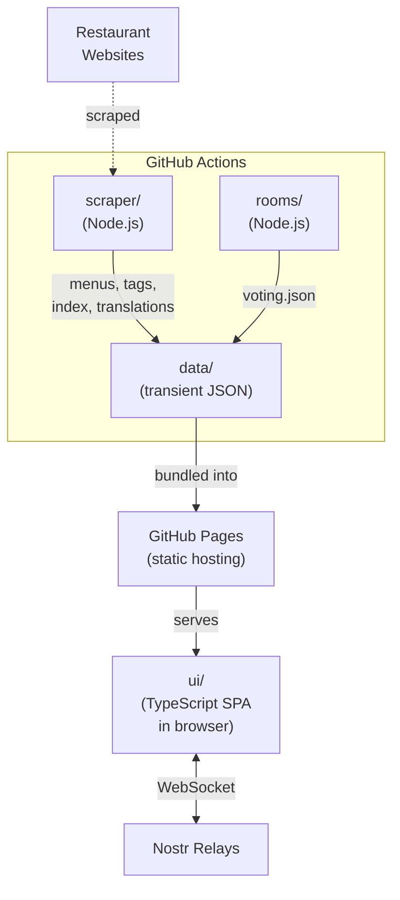
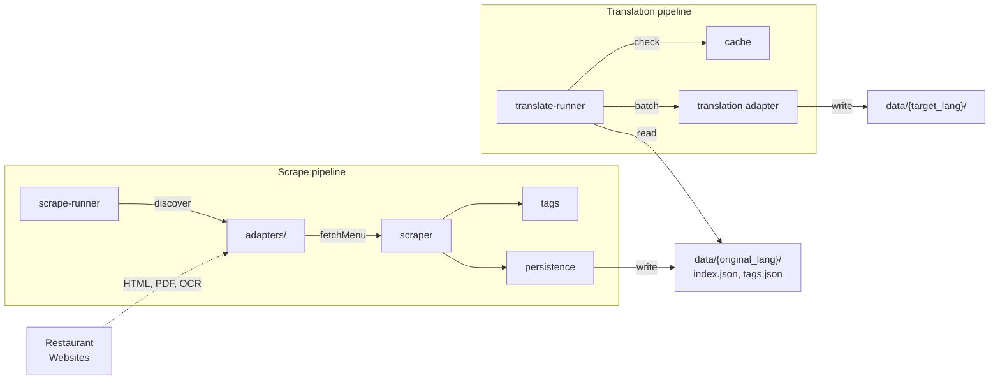
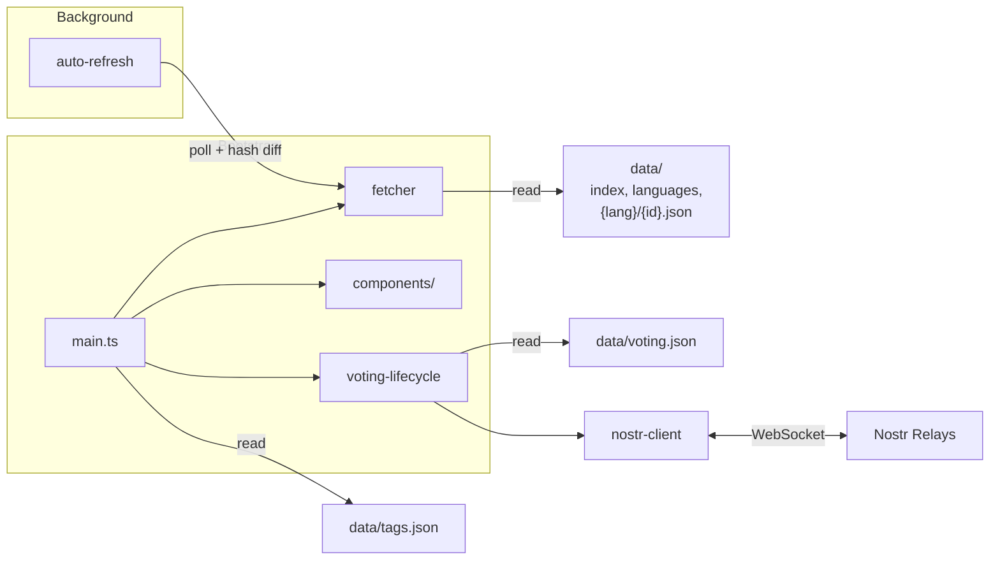

# Forkcast

**Discover lunch menus. Vote with your team. Decide where to eat.**

Forkcast aggregates daily lunch menus from a wide range of restaurants near Austria Campus in Vienna and lets you vote on where to eat using decentralized [Nostr](https://nostr.com/) protocol, no accounts, no signups, no servers.

Most restaurants in the area only publish their menus in German. For colleagues who don't speak German well, that makes lunch a guessing or lookup game. Forkcast scrapes these menus, translates them automatically, and gives everyone an equal seat at the table, both in understanding what's on the menu and in voting where to go.

> **Try it out for yourself: https://djaffry.github.io/mahlzeit-test/**

## Features

### Menu Aggregation & Scraping

A pluggable adapter pipeline scrapes lunch menus from a wide range of restaurants daily - local Viennese classics, Asian, Middle Eastern, and international cuisine. Each restaurant has its own scraper adapter that handles its specific site structure. The pipeline supports three extraction methods depending on what the restaurant publishes:

- **HTML parsing** via jsdom for structured menu pages
- **PDF extraction** via unpdf for downloadable menu files
- **OCR** via Tesseract.js for image-only menus (scanned PDFs, JPEGs)

Scraped menus are automatically translated with a content-hash-based cache to avoid redundant translation calls. In our case, the original language is German (de) and we translate to English (en), but the system is modular, you could scrape in any language and translate to any other. The translation is best-effort: most of the time it gets where it needs to be, but sometimes you get hilarious results, "Du Chef" (French for "from the chef", appearing in German menu text) becomes "You Boss" in English.

The UI auto-refreshes in the background every 10 minutes with hash diffing and only re-renders when data actually changed.

### Dietary Tag Detection & Filtering

Tags are inferred automatically from menu text using keyword matching against a configurable tag hierarchy:

- **Hierarchy-aware filtering** selecting a parent tag (e.g. "Meat") expands to include all children (Beef, Pork, Poultry, Lamb). Implemented with recursive expansion.
- **Contradiction resolution** if an item matches both plant-based and meat keywords, the meat tag wins and the plant-based tag is pruned
- **Category fallback** if no item-level keywords match, the category name is checked (e.g. a "Vegan Bowls" category tags all its items as Vegan)
- Filter state is persisted in `localStorage` across sessions

### Decentralized Voting via Nostr

Voting runs entirely on the [Nostr](https://nostr.com/) protocol - no backend, no database, no accounts:

- **Client-side keypair generation** a Nostr keypair is created on first visit and stored in `localStorage`, giving each user a pseudonymous avatar (icon + color combo)
- **Kind 30078 events** votes are published as NIP-33 replaceable user state events, keyed by d-tag (`{appId}/vote/{date}` for default rooms, `{appId}/pvote/{roomId}/{date}` for private rooms)
- **Multi-relay redundancy** events are published to and subscribed from multiple public relays in parallel via a relay pool
- **SHA-256 obfuscation** restaurant IDs are hashed with a salt before publishing so relay-stored events contain only opaque hex strings, not restaurant names
- **Private rooms** shareable via URL, isolated by a random room ID in the d-tag so events are not discoverable without the link
- **Client-side filtering** the Nostr protocol means anyone can publish events to a relay. The client parses all incoming messages and decides whether to accept or drop them. There is no server-side validation, your browser is the authority on what it trusts.

### Interactive Tools

- **Dice roll** random menu or restaurant picker triggered by keyboard (`D` / `Space`), button, or device shake (`DeviceMotionEvent`)
- **Map** interactive map with markers per restaurant
- **Full-text search** indexes restaurant names and all menu item text, accessible via `/` or `Ctrl+K`
- **Image-based and Text-based sharing** selected menu items are rendered as an image or text, then exported to clipboard or the Web Share API
- **Identity card export** share your Nostr voting identity as a visual business card

### UI & Frontend

Built as a very lightweight, vanilla TypeScript SPA with zero framework dependencies, just DOM APIs, CSS custom properties and Vite:

- **Catppuccin theming** Mocha (dark) and Latte (light) palettes - https://catppuccin.com/
- **Bilingual i18n** English and German with a custom translation system, toggled at runtime
- **PWA manifest** installable on mobile with themed browser chrome and maskable icons
- **Haptic feedback** `navigator.vibrate()` on supported devices for tactile interaction cues
- **Keyboard-driven** shortcut coverage (see table below)

### Keyboard Shortcuts

| Key | Action |
|-----|--------|
| `/` or `Ctrl+K` / `Cmd+K` | Open search |
| `Escape` | Close search, map overlay, or dismiss notifications |
| `1` - `5` | Jump to weekday (Monday - Friday) |
| `Arrow Left` / `Arrow Right` | Navigate between days |
| `D` or `Space` | Roll the dice |
| `L` | Toggle language (DE/EN) |
| `I` | Open feedback link |
| `R` | Reload page |
| `P` | Share selection as picture (when items selected) |
| `T` | Share selection as text (when items selected) |

## Architecture

The project is split into four domains that communicate through a shared, transient `data/` directory. Each module has its own `package.json` and can be built and run independently.

```
project_root/
  data/                 # Transient shared output (generated JSON, treat as transient, never hand-edited)
  scraper/              # Menu scraping & translation pipeline
  rooms/                # Nostr voting room configuration generator
  ui/                   # Vanilla TypeScript frontend (served by Vite)
  .github/workflows/    # CI/CD automation
```

### System Context



### Data (`data/`)

**Treat this directory as transient.** All files here are generated by the scraper, translation, and rooms pipelines, **never hand-edited**. The entire directory can be deleted and regenerated from scratch by running the scraper and room generator. It is committed to git only so that the static site build can include it without running the full pipeline. It also serves as a clean interface for the other modules to act on.

```
data/
  index.json            # Array of restaurant IDs
  languages.json        # Available languages (e.g. ["de", "en"])
  tags.json             # Tag hierarchy with display names and colors
  voting.json           # Nostr relay list, appId, salt
  {lang}/               # Per-language directory (e.g. de/, en/)
    {id}.json           # One file per restaurant
  .translation-cache.json  # Content hashes to skip unchanged translations
```

Restaurant data is stored as one JSON file per restaurant. The format is defined by TypeScript interfaces in [`ui/types.ts`](ui/types.ts).

### Scraper (`scraper/`)

The scraper uses an **adapter pattern**, each restaurant has its own adapter in `scraper/src/restaurants/adapters/` that knows how to parse that restaurant's website. Adapters come in two types:

- **Full adapters** implement `fetchMenu()` to scrape HTML, parse PDFs (via `unpdf`), or OCR images (via `tesseract.js`) into structured menu data
- **Link adapters** simply point to an external URL for restaurants that don't have a rotating menu but you'd still want to have as an option to show and vote on



The pipeline runs as:

1. `scrape-runner.ts` discovers all adapters and calls the orchestrator
2. `scraper.ts` fetches each restaurant with retry logic
3. `tags.ts` detects or infers dietary tags from menu item text. Keywords are defined in [`scraper/src/restaurants/tags.ts`](scraper/src/restaurants/tags.ts), and the tag hierarchy is exported alongside them in [`data/tags.json`](data/tags.json).
4. `persistence.ts` writes individual JSON files to `data/{original_lang}/{id}.json` and generates `data/index.json` and `data/tags.json`

Translation is a separate step in the same module:

1. `translate-runner.ts` reads all original-language JSON from `data/{original_lang}/`
2. Computes content hashes and checks a translation cache (`data/.translation-cache.json`) to skip unchanged restaurants
3. Extracts translatable strings, deduplicates, and batch-translates via pluggable adapter
4. Writes translated output to `data/{target_lang}/{id}.json`
5. If translation fails for a restaurant, the original language JSON is copied as a fallback

### Rooms (`rooms/`)

A small module that generates the voting configuration:

- `rooms/config/relays.json` list of Nostr relay URLs and a `minRelays` threshold
- `rooms/config/app.json` a unique `appId` (UUID) and `salt` (hex) for hashing restaurant IDs in vote events
- `rooms/src/create-rooms.ts` validates both configs and writes `data/voting.json`
- Health check script probes all relays via WebSocket and fails if fewer than `minRelays` are reachable

### UI (`ui/`)

A vanilla TypeScript single-page app bundled with Vite. No framework, just DOM APIs, CSS and minimal runtime dependencies.

```
ui/
  main.ts               # App bootstrap and render orchestration
  config.ts             # Title, subtitle, data path, map center, refresh interval
  types.ts              # Core data types (RestaurantData, WeekMenu, DayMenu, etc.)
  data/                 # Data fetching and auto-refresh
  components/           # UI components (search, filters, map, dice, share, carousel)
  rooms/                # Voting: Nostr client, lifecycle, avatars, identity
  i18n/                 # Translation system with de.json and en.json
  styles/               # CSS with Catppuccin Mocha/Latte palettes, CSS variables
  utils/                # Date, DOM, haptic feedback, tag hierarchy helpers
```



### CI/CD (`.github/workflows/`)

Three workflows automate the pipeline:

- **fetch-and-deploy.yml** runs on weekday mornings (staggered schedule). Scrapes all restaurants, translates, typechecks, tests, commits data changes, and deploys to GitHub Pages. Translation failures are non-blocking (warns but continues).
- **voting-room.yml** triggered on changes to `rooms/config/` or `rooms/src/`. Regenerates `data/voting.json`, commits, and redeploys.
- **relay-health-check.yml** runs daily. Probes all Nostr relays and fails if too few are reachable.

## Getting Started

```bash
npm install
cd scraper && npm install && cd ..
cd rooms && npm install && cd ..

# Scrape menus (fetches latest from restaurant websites)
npm run scrape

# Translate menus (optional)
npm run translate

# Start dev server
npm run dev
```

### Build, Test, Verify

```bash
# Build for production (outputs to dist/)
npm run build        

# Run all tests and typecheck
npm test             
npm run typecheck

# Full pipeline: scrape, translate, generate rooms, test
npm run verify       
```

## Design Decisions

### Zero cost, zero backend, zero accounts

Forkcast runs entirely without a backend server. The frontend is a static site on GitHub Pages, menu data is generated by CI, and voting happens directly between browsers and public Nostr relays. There is no database, no API server, no cloud functions, no hosting bill. No account or signup is needed, not to use the app, not to host it, not to develop on it. Everything runs on GitHub's free tier (Actions + Pages) and volunteer-operated Nostr relays.

### Fresh data through CI scraping

Rather than scraping on-demand (which would require a server), menu data is fetched by scheduled GitHub Actions workflows on weekday mornings. The scraped JSON is committed to the repository and deployed as static files. This means the data is always a snapshot - fresh enough for daily lunch menus, but never real-time. If a scrape fails, we can usually fall back on previous day's data.

### Pluggable Adapter pattern for scrapers

Each restaurant has its own adapter module that knows how to parse that restaurant's specific website. Adapters conform to a shared interface (`FullAdapter` with a `fetchMenu()` method, or `LinkAdapter` for external-only links) and are discovered automatically at runtime by scanning the adapters directory. Adding a new restaurant means adding a single file - no registration, no config changes. The scraper runs all adapters in parallel with independent retry logic, so one broken restaurant doesn't block the others.

### Interfaces as the data contract

The data model (`RestaurantData`, `WeekMenu`, `DayMenu`, `MenuItem`, `MenuCategory`) is defined as TypeScript interfaces, shared in spirit between the scraper output and the UI input. This keeps the JSON format stable and self-documenting - the interface _is_ the schema. A `WeekMenu` is `Partial<Record<Weekday, DayMenu>>`, meaning days can be missing (not every restaurant serves every day). A `DayMenu` contains `categories`, each with a `name` and `items`. A `MenuItem` has `title`, `description`, `price`, `tags`, and `allergens`. No ORM, no schema migration, no build step to sync types - the JSON files on disk are the source of truth and the ones in the previous commits are preserved history.

### Why Nostr for voting

We needed collaborative voting without running a server. Nostr gives us that: it's an open protocol with public relays that anyone can write to and read from. Users don't need to create accounts. A keypair generated in the browser is enough. Events are signed, so votes can't be forged. Multiple relays provide redundancy. If one goes down, others still work. And because it's a public protocol, there's no vendor lock-in and no cost.

### Privacy on a public protocol

Nostr relays are public infrastructure outside your and our control. Anyone operating a relay can read and store the events published to it. This project addresses this by **never publishing any personal information**. This is achieved by giving you a pseudonym - a food in combination with a color. That way, just by taking a look at the events, one would not immediately infer that the messages sent are about lunch voting - before a vote is published, the restaurant ID is hashed with SHA-256 using a salt. The resulting event content looks like `{"votes": ["a1b2c3...", "d4e5f6..."]}` opaque hex strings that mean nothing without the salt and restaurant list.

**This is not cryptographic privacy and is not meant to be treated as such.** The salt and restaurant list ship with the app, so anyone who has the frontend code can reconstruct the mapping. But a relay operator who is just storing raw events cannot casually read which restaurants people voted for. The obfuscation makes the data inert at rest: it only becomes meaningful when combined with the app's public configuration.

The client parses and filters all incoming Nostr messages, it decides what to accept and what to drop. That's the Nostr protocol: there is no server-side validation layer, your browser is the gatekeeper. This also means if someone discovers a private room ID, they can join and vote in that room. But let's not get ahead of ourselves - this is lunch voting, not state secrets.

Private rooms add another layer: their d-tags include a random room ID (`${appId}/pvote/${roomId}/${date}`), so events from different rooms are isolated and not discoverable unless you know the room ID.

## Adding a New Restaurant

You can contribute by adding a new restaurant adapter! That would be very awesome. Here's how:

### 1. Create the adapter

Add a new file in `scraper/src/restaurants/adapters/` (e.g. `myrestaurant.ts`). Use an existing adapter as a template. The minimal structure:

```typescript
import { JSDOM } from 'jsdom';
import type { FetchableAdapter, WeekMenu } from '../types.js';
import { inferTags, resolveTags } from '../tags.js';

async function fetchMenu(): Promise<WeekMenu> {
  const res = await fetch('https://example.com/menu');
  if (!res.ok) throw new Error(`MyRestaurant: HTTP ${res.status}`);
  const html = await res.text();
  const doc = new JSDOM(html).window.document;

  // Parse the menu HTML into the WeekMenu structure
  // Return an object keyed by German weekday names: Montag, Dienstag, etc.
  return { /* ... */ };
}

const adapter: FetchableAdapter = {
  id: 'myrestaurant',           // Unique ID, used as filename in data/
  title: 'My Restaurant',       // Display name (emoji prefix encouraged)
  url: 'https://example.com',   // Restaurant homepage
  type: 'full',                 // 'full' | 'specials' | 'link'
  cuisine: ['Italian'],         // Cuisine tags for display
  coordinates: { lat: 48.22, lon: 16.39 },  // For the map
  fetchMenu,
};

export default adapter;
```

Adapters are discovered automatically, no registration step needed.

### 2. Tag detection

You don't need to tag items manually. Call `inferTags()` on each item's title and description, then `resolveTags()` to merge with any adapter-level tags. The tag system handles detection and hierarchy automatically.

### 3. Test it

```bash
cd scraper && npm run build && npm run scrape
```

Check `data/{original_lang}/myrestaurant.json` to verify the output looks right.

### 4. Optional metadata

Adapters can also specify:
- `edenred: true` accepts Edenred vouchers
- `outdoor: true` has outdoor seating
- `stampCard: true` offers a loyalty stamp card
- `reservationUrl: '...'` link to reservation page
- `availableDays: ['Montag', 'Dienstag', ...]` if not open every weekday

## Relay Configuration

Voting relays are configured in `rooms/config/relays.json`:

```json
{
  "relays": [
    "wss://relay.damus.io",
    "wss://nos.lol",
    "wss://relay.primal.net",
    "wss://relay.snort.social"
  ],
  "minRelays": 2
}
```

- **relays** Nostr relay WebSocket URLs. Votes are published to all of them for redundancy. Adding or removing a relay here and pushing to `main` triggers the voting-room workflow to regenerate `data/voting.json` and redeploy.
- **minRelays** the health check fails if fewer than this many relays are reachable (5-second WebSocket probe per relay). This prevents deploying a broken voting config.

The app identity is configured in `rooms/config/app.json` (a UUID and salt). **Please change this if you're forking the project**.

## Browser Support

Forkcast targets **ES2022** and uses the following browser APIs:

| API | Required | Used for |
|-----|----------|----------|
| `fetch` | Yes | Loading menu data and translations |
| `localStorage` | Yes | User identity, filter state, collapsed cards |
| `crypto.subtle` | Required for Voting | SHA-256 hashing for vote obfuscation |
| `WebSocket` | Required for Voting | Nostr relay communication |
| `Canvas 2D` | Preferred | Rendering shareable menu images |
| `navigator.clipboard` | Preferred | Copying share links (falls back gracefully) |
| `navigator.vibrate` | Optional | Haptic feedback on mobile |
| `DeviceMotionEvent` | Optional | Shake-to-roll dice |
| `matchMedia` | Optional | Respects `prefers-reduced-motion` |

In practice: any modern browser from 2022 onwards (Chrome 94+, Firefox 93+, Safari 15.4+, Edge 94+).

## Known Limitations

- **Scraper fragility** restaurant websites change without notice. When a site redesigns, its adapter breaks and returns empty data until someone updates it. The CI pipeline handles this gracefully (previous data is preserved), but menus for future days may not show until the adapter is fixed.
- **Translation quality** automatic translations are best-effort and occasionally produce awkward or hilarious phrasing. There is no human review step.
- **Obfuscation, not encryption** vote events on Nostr relays use hashed restaurant IDs, but the salt and restaurant list are public. Anyone with the app code can reconstruct which hashes map to which restaurants. This is deliberate the goal is to make relay data opaque at rest, not to provide cryptographic privacy.
- **No offline voting** voting requires a live connection to at least one Nostr relay. Menu browsing works offline if data was previously loaded.
- **OCR accuracy** restaurants that publish menus as images (PDFs with scanned text) are parsed via Tesseract.js OCR, which can misread characters, especially with handwritten or stylized fonts.
- **Time-of-day blindness** menus are scraped on a schedule (weekday mornings). If a restaurant updates its menu mid-day, the change won't appear until the next scrape run.

## Troubleshooting

### Scraper returns empty menu

A restaurant adapter is likely broken due to a website change. Check what the site looks like now and compare with the adapter's parsing logic in `scraper/src/restaurants/adapters/`. Run the scraper locally to see the error:

```bash
cd scraper && npm run build && npm run scrape
```

Look for `FAIL` lines in the output. The `error` field in the restaurant's JSON file will also contain the failure message.

### Voting not loading

- Check that `data/voting.json` exists and contains valid relay URLs
- Run the relay health check: `cd rooms && npm run build && npm run health-check`
- Open browser DevTools and look for WebSocket connection errors
- Public relays occasionally go down, if one is unreachable, voting still works as long as others are available

### Translation failed

Translation failures are non-blocking, the original language is served as a fallback. If you see untranslated text when another language is selected, the translation pipeline likely hit a rate limit or network error. Re-run:

```bash
cd scraper && npm run build && npm run translate
```

The translation cache (`data/.translation-cache.json`) skips unchanged restaurants, so re-running is cheap.

### Stale data overlay showing

The UI shows a "stale data" overlay when menu data is older than expected. This usually means the CI scrape didn't run or didn't find changes. Check the GitHub Actions workflow runs for failures.

## Contributing

Contributions are welcome! Whether it's adding a new restaurant, fixing a scraper, improving the UI, or suggesting a feature, I'd love your help.

Please read [CONTRIBUTING.md](CONTRIBUTING.md) for guidelines on how to get involved.

The quickest way to start: [open an issue](https://github.com/djaffry/mahlzeit-test/issues/new) on GitHub.

## License

Please refer to [LICENSE](LICENSE).
